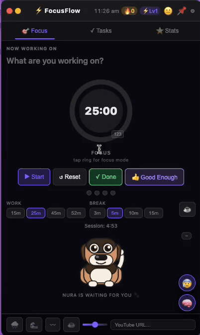
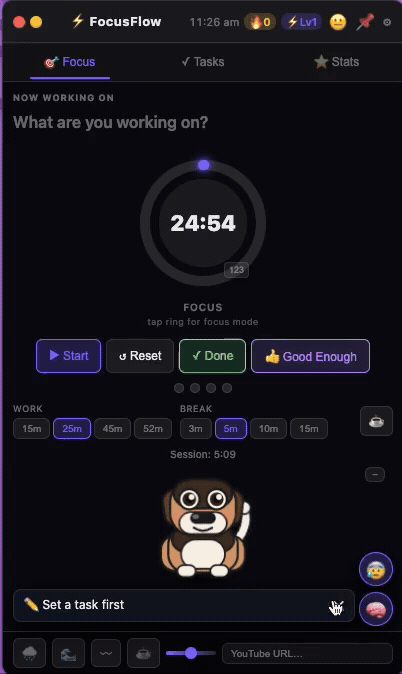
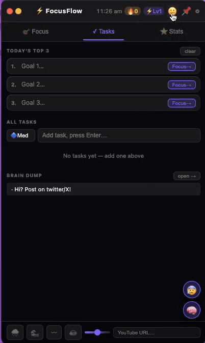

# Dopamine

**A lightweight macOS widget built by an ADHDer for ADHDers. Pomodoro + tasks + energy-aware streaks that actually work when your brain doesn't.**

One widget. Always on your desktop. No accounts, no cloud, no subscriptions. Just structure that fits the way your brain actually operates.

---

## See it in action

### Your command center: Pomodoro timer, task management, XP streaks — all in one tiny widget.


### SOS mode: breathing exercises when you're fried + brain dump to capture stray thoughts without losing focus.


### Make it yours: dark/light/pastel themes, accent colors, celebrations, and more.


---

## Why I built Dopamine

I have ADHD.

For years I tried every productivity app out there, and every single one felt like it was designed for someone else's brain — someone neurotypical who could calmly follow linear task lists, stick to rigid timers, and survive those guilt-trip streaks that reset to zero the moment you had a bad day.

They all punished me for being human.

So one weekend I finally got fed up and built Dopamine — a tiny, always-on macOS widget that actually fits the way my brain works.

It does exactly three things:

- **Helps me start** when my brain is screaming "later"
- **Helps me keep going** without demanding perfection
- And most importantly — **it doesn't punish me** when I stall, get stuck, or have an off day

No accounts. No cloud. No subscriptions. Just structure that finally feels kind instead of judgmental.

It has the "Good Enough" button that killed my perfectionism, relentless carry-over tasks that don't disappear at midnight, Stuck Flow prompts that gently unblock me, hyperfocus guards that keep me alive, and dopamine hits that actually reward doing instead of planning.

Dopamine isn't another productivity tool. It's the one I wish had existed for me — built by an ADHDer, for ADHDers.

If it feels like it was made for your brain too... you're not alone. Star it, try it, and let me know what your brain thinks.

---

## Features

🍅 **Pomodoro Timer** — Configurable work/break cycles with a visual progress ring. Snooze (+10 min) when you're in flow.

✅ **Task Management** — Add tasks with effort levels (low/med/high), break them into substeps, and track what matters.

👍 **"Good Enough" Button** — The perfectionism killer. Ship the B+ version, collect your XP, move on. This one feature alone changed how I work.

🔄 **Relentless Carry-over** — Tasks don't vanish at midnight. Unfinished items roll forward until you finish them or deliberately remove them.

🧱 **Stuck Flow** — Totally paralyzed? Dopamine walks you through isolating the tiniest next action and wires it as a substep.

⚡ **Hyperfocus Guards** — Alerts that break you out before you dehydrate, forget to eat, or burn through 6 hours without standing up.

🎮 **XP + Levels + Streaks** — Scaled rewards tied to execution. Dopamine wired to doing, not planning.

🎵 **Focus Music** — Embedded YouTube audio right in the widget. No browser tab, no context switch.

🐕 **Nura (Companion Dog)** — An animated buddy with contextual messages. Collapsible when you need space.

📊 **History + Wall of Wins** — Per-day archive of everything you completed. Proof that you're getting things done, even on the days it doesn't feel like it.

🎨 **Themes** — Dark, Light, Pastel. Five accent colors. Because environment matters.

🧠 **Brain Dump** — Quick capture mid-session so stray thoughts don't derail your focus.

⌨️ **Keyboard Shortcuts** — Press `?` for the full list.

---

## Why this isn't like other tools

**No linear perfectionism.** Most productivity apps assume you'll complete tasks in order, one by one, like a well-adjusted adult. Dopamine assumes you won't — and that's fine.

**Carry-over, not daily wipe.** Your tasks don't disappear when the clock hits midnight. They stay until you deal with them. No pretending yesterday didn't happen.

**"Good Enough" is a real completion state.** It earns XP, shows in your history with a badge, and counts as a win. Because done is better than perfect.

**100% local.** Zero backend. Zero telemetry. Zero accounts. Everything lives in your machine's localStorage. Export your data as JSON anytime.

**No build pipeline.** The entire UI is vanilla HTML/CSS/JS in a single file. No React, no webpack, no nonsense. Read the source — it's all there.

---

## Installation

### Option A: Download the app (recommended)

1. Go to the [latest release](https://github.com/Oxymarun/dopamine/releases/latest)
2. Download **Dopamine-1.0.0-arm64.dmg**
3. Open the `.dmg` and drag Dopamine to your Applications folder
4. **First launch only** — open Terminal and run:
   ```bash
   xattr -cr /Applications/Dopamine.app
   ```
5. Launch Dopamine from Launchpad

> macOS blocks unsigned apps by default. The `xattr` command removes the quarantine flag. This is a one-time step.

### Option B: Run from source (for devs)

```bash
git clone https://github.com/Oxymarun/dopamine.git
cd dopamine
npm install
npm start
```

---

## Tech Stack

- macOS + Electron 28
- Vanilla HTML/CSS/JS — zero framework bloat, zero build step
- Everything lives in `index.html` — read the source
- localStorage for persistence, no server, no telemetry

---

## License

MIT. Fork it. Break it. Ship your version.

---

⭐ **Star this repo if it resonates** ❤️ — it helps other ADHDers find it.
